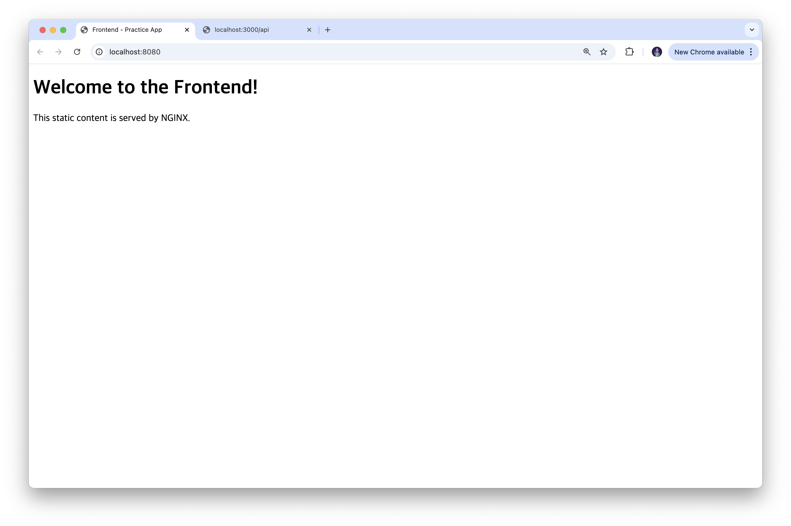
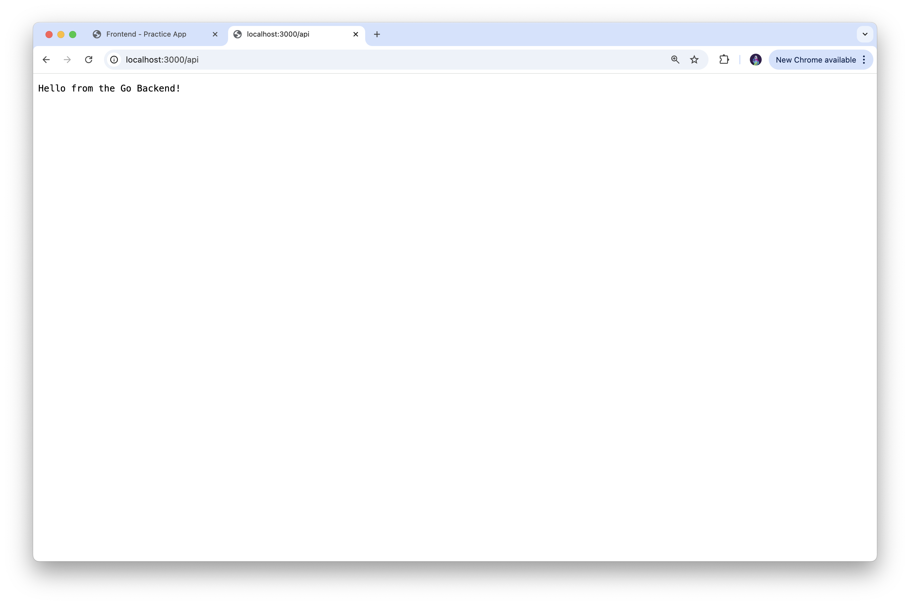
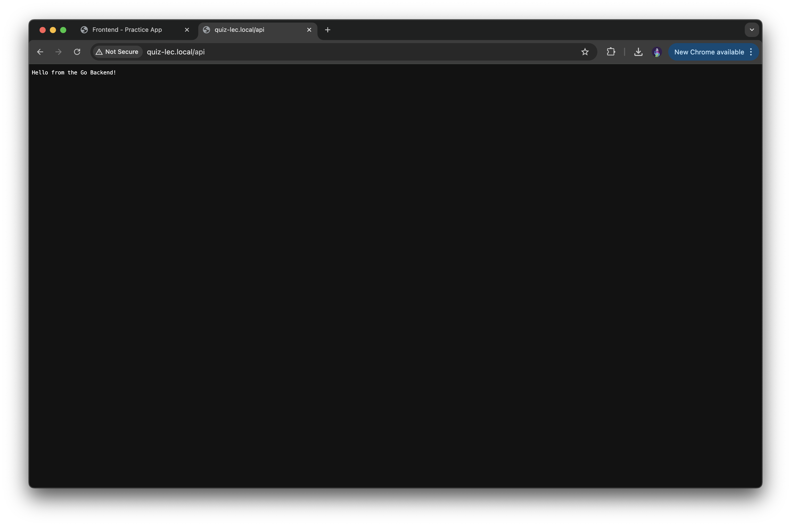
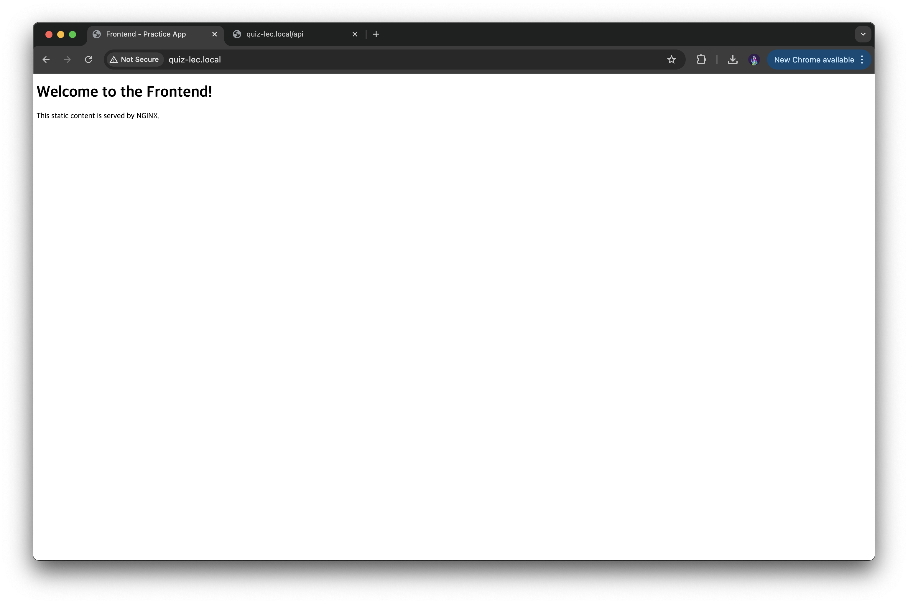
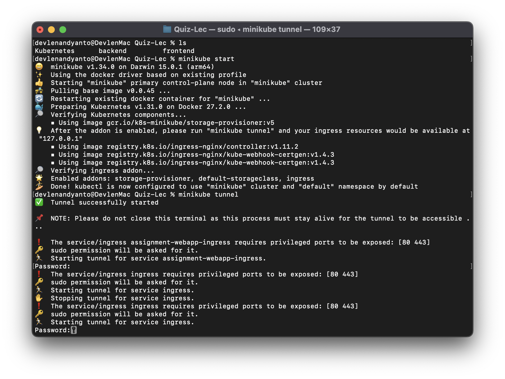

# Simple Web App Deployment with NGINX Frontend and Go Backend

This project consists of a simple web application that uses:
- **Frontend**: Served with NGINX
- **Backend**: Built using Go language

## Local Deployment with Minikube

The web application is deployed locally using **Minikube** on **macOS**. 

### Setup Ingress with Minikube Tunnel

Ingress is configured by using `minikube tunnel`. Additionally, the **/etc/hosts** file is edited with the following entry to route traffic to the local Minikube deployment: `127.0.0.1 quiz-lec.local`

## Image Result

This is the image result of the Docker containers for the backend and frontend services.

### Docker Container 1 - Frontend Result
This image shows the frontend result of service container built using Docker Container.

### Docker Container 2 - Backend Service
This image shows the backend result of service container built from the Go lang using Docker Container.

### Ingress Setup - Local Deployment with Minikube

This is the image result of the Minikube ingress deployment.

#### Ingress 1
This image shows the result of backend (/api) using Kubernes service (local). 
This is obtained from the url quiz-lec.local/api using Ingress. 

#### Ingress 2
This image shows the result of frontend using Kubernes service (local). 
This is obtained from the url quiz-lec.local using Ingress. 

### Minikube Tunnel

This image shows the Minikube tunnel in action for routing traffic to the local services.

## Deployment Commands

To build the Docker images, the following commands were used:

1. **Backend Docker Image**:
    `docker build -t chronzon/quiz-lec-backend-go:latest .`

2. **Frontend Docker Image**:
   `docker build -t chronzon/quiz-lec-frontend-nginx:latest .`

## Deployment Commands

To push the Docker images to Docker HUB, the following comands were used: 

1. **Backend Docker Image**:
    `docker tag chronzon/quiz-lec-backend-go:latest chronzon/quiz-lec-backend-go:latest`
    `docker push chronzon/quiz-lec-backend-go:latest`

2. **Frontend Docker Image**:
    `docker tag chronzon/quiz-lec-frontend-nginx:latest chronzon/quiz-lec-frontend-nginx:latest`
    `docker push chronzon/quiz-lec-frontend-nginx:latest`

   

